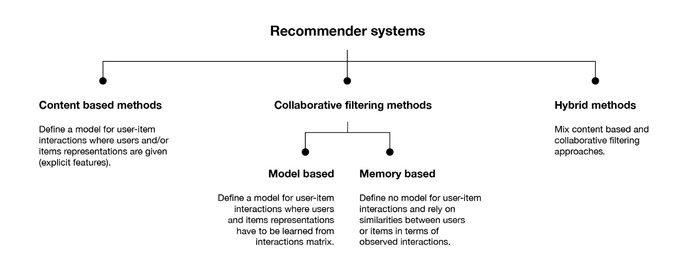

## Recommendation Systems

## 1.Introduction
- 1.What are Recommendation_Systems?
- Recommender systems are the systems that are designed to recommend things to the user based on many different factors. These systems predict the most likely product that the users are most likely to purchase and are of interest to. Companies like Netflix, Amazon, etc. use recommender systems to help their users to identify the correct product or movies for them. 
- The recommender system deals with a large volume of information present by filtering the most important information based on the data provided by a user and other factors that take care of the user’s preference and interest. It finds out the match between user and item and imputes the similarities between users and items for recommendation. 
- Both the users and the services provided have benefited from these kinds of systems. The quality and decision-making process has also improved through these kinds of systems.

- 2.Different Types of Recommendation_Systems that are mostly used in real time businness case studies?
- The 3 important types of Recommendation Systems that are mostly used in business world are:

- 1.Content based methods:
- Define a model for user-item interactions where users and/or items representations are given(explicit features)

- 2.Collaborative filtering methods:
- 2.1.Method based:
- Define a model for user-item interactions where users and items representations have to be learned from interactions matrix.
- 2.2.Memory based:
- Define no model for user-item interactions and rely on similarities between users or items in terms of observed interactions.

- 3.Hybrid methods
- Mix content based and collaborative filtering approaches.

 
## 2.Objective
- In this project, we are trying to cover all the three types of recommendation systems with practical implementation. 

## 3.Steps to execute this Project.
- NOTE:Running the whole project might take an extended period of time. Training time also depends on your system's computation capabilities.
- 1.Download/fork/clone the project by clicking [here] (https://github.com/balusena/balugithub/tree/master/Recommmendation_Systems) or just unzip the folder provided.

## 4.Important Consideration
- This project runs perfectly on a windows machine by following the steps mentioned in section 3. If want to run on a different OS, encoding might need to be changed.

## 5.Further work to be done
- 1.Need to implement this project further with other different recommendation systems and compare the results.
- 2.Planning to build a end-end web based recommendation application using the HTML, CSS, JAVA SCRIPT, Flask, or Strealit using Python and deploy it in Heroku, AWS Platforms. 
- 3.Find a way to cover different important recommendation systems that are widely used in real time business(I would be grateful if someone could help me on this, in improving the model for better results).
