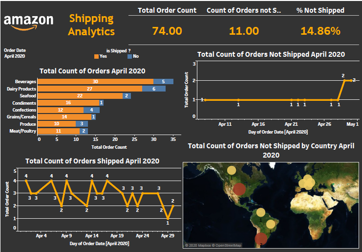

# 1.Tableau-Projects
Learnt Data Visualization and Data Analytics with Tableau by solving 2 Realistic Analytics Projects.

  <pre>
  1. Amazon Shipping Analytics               
  2. UT Mart Sales Analytics            
  </pre>

## 2.Screenshots

### 1. Amazon Shipping Analytics Dashboard

### 2. UT Mart Sales Analytics Dashboard

## 3.Further work to be done:
-1.Planning to implement these projects on PowerBI tool by using databases connections for E(Extract)-T(Transform)-L(Load) process and applying DataWareHouse(DWH) techniques.
-2.Find a way to build BI Reports and Dashboards by using Tableau(I would be grateful if someone could help me on this project enhancement.)

          

  
  
