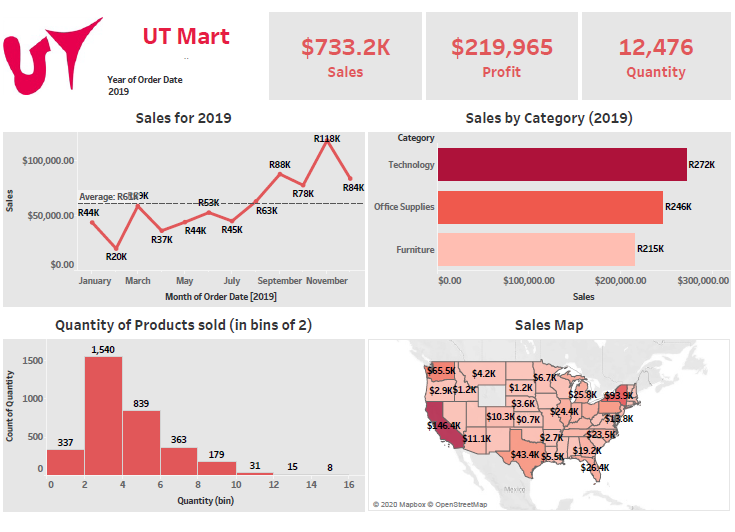

### 1.What is Tableau ?  

Tableau software is one of the fastest growing data visualization tools which is currently being used in the Business intelligence industry.  
It is the best way to change or transform the raw set of data into an easily understandable format with zero technical skills and coding knowledge.   

Tableau is basically a data visualization tool which provides pictorial and graphical representations of data.

### 2.What is Tableau used for?  

Usage of Tableau software are listed below:

- Tableau software is used to translate queries into visualization.  
- It is also used for managing metadata.  
- Tableau software imports data of all sizes and ranges.  
- For a non-technical user, Tableau is a life saver as it offers the facility to create ‘no-code’ data queries.  
- Ever since it was introduced, this data visualization tool is used for Business Intelligence industry. Organizations like Amazon, Walmart, Accenture, Lenovo, and so on widely use Tableau.  

### 3.UT Mart Sales Analytics Overview 

UT Discount Mart is a supermarket owned by UT GROUP.They want to build a BI dashboard where it can track how well Discount Mart is doing for
this year 

(in terms of Sales,Profit and Quantity Sold),and also like to know how well categories are performing as well as different regions.They assumes that most

of the customers buy 2 or more products per basket/order but would like this confirmed by the data and also noted that Profit is 30% of the selling price.

They have given us csv files from which we have to create a Dashboard for quick review so that they can take further decisions for the benefit of the company.

Thus, we created below interactive dashboard as per his requirement. Now,they could switch and view different shipping stats for different months and years.

He has given us csv files from which we have to create a Dashboard for his quick review so that he could take further decisions for the benefit of the company.

Thus, we created below interactive dashboard as per his requirement. Now, he could switch and view different shipping stats for different months and years.   

### 4.Usage:

- Clone my repository here ===> (https://github.com/balusena/balugithub/tree/master/BI_Reports_Dashboards/UT_Mart_Sales_Analytics) 

##  5.UT_Mart_Sales_Analytics_Dashboard

