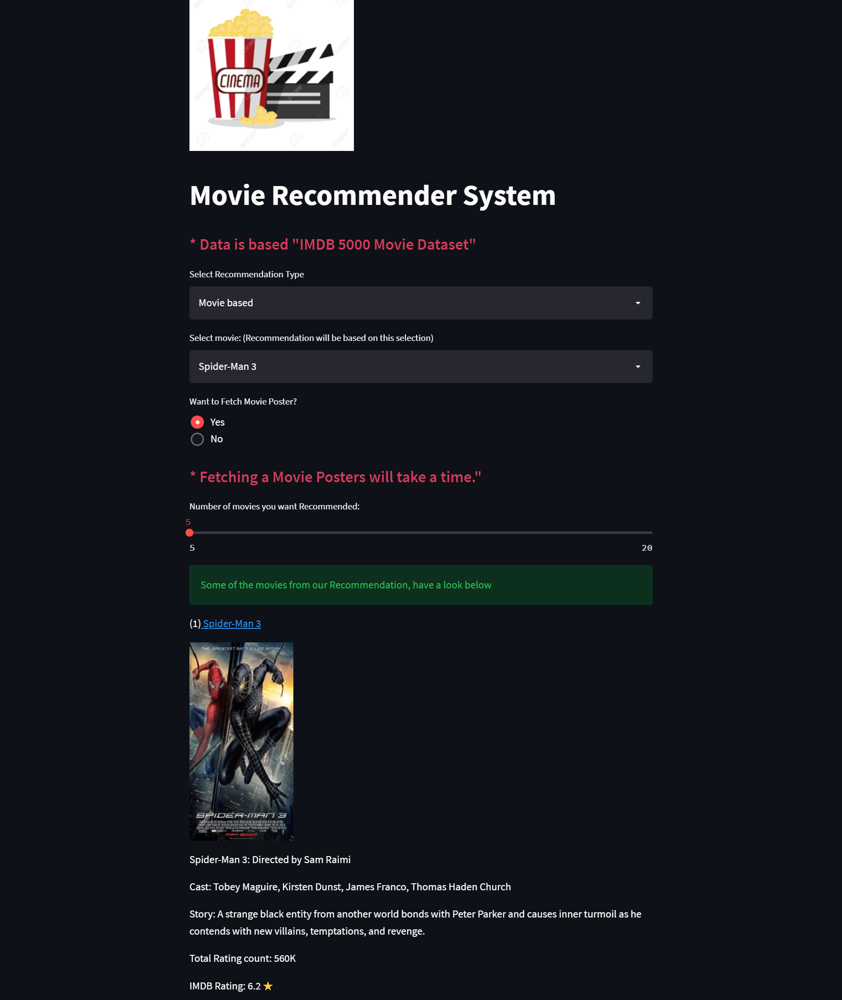
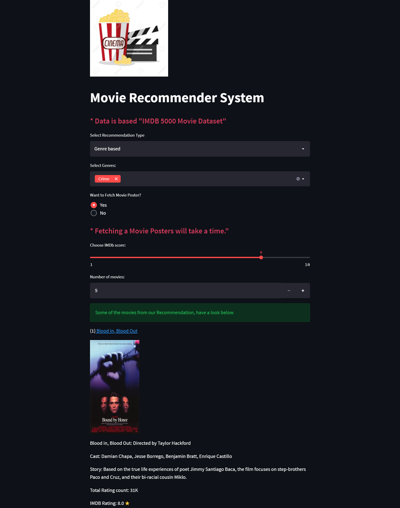

## Movie Recommendation🍿 Engine
                 
   

## 1.Movie Recommendations For You

## 2.Source
- [IMDB Top_5000 Movies Data](https://github.com/balusena/balugithub/tree/master/Movie_Recommender_System_KNN/Data)

## 3.Features
- User Responsive UI
- Movie Story
- Movie Posters
- Directors & Cast information
- Total ratings*
- IMDB Ratings⭐

## 4.Usage
- Clone my repository < https://github.com/balusena/balugithub/tree/master/Movie_Recommender_System_KNN >
- Open CMD in working directory.
- Run following command.
- pip install -r requirements.txt
- 'app.py' is the main Python file of Streamlit Web-Application. 
- To run app, write following command in CMD. or use any IDE.
- streamlit run App.py
- 'Movie_Data_Processing.ipynb' is the notebook of data processing.
- 'Classifier.py' is the main file which is containing a KNN Algorithm.
- For more explanation of this project see the tutorial on Machine Learning Hub YouTube channel.

## 5.Screenshots
### Movie based Recommendation

### Genre based Recommendation

## 6.Heroku deployment
- The app is deployed on Heroku at ===> https://movie-recommender-engine-knn.herokuapp.com/

## Follow thse steps to deploy your streamlit app successfully into Heroku Cloud Platform
-- Deploy using Heroku Git
-  Use git in the command line or a GUI tool to deploy this app.

-  Install the Heroku CLI
-  Download and install the Heroku CLI.

-  If you haven't already, log in to your Heroku account and follow the prompts to create a new SSH public key.

-- $ heroku login
-  Clone the repository
-  Use Git to clone https://movie-recommender-engine-knn's source code to your local machine.

-- $ heroku git:clone -a https://movie-recommender-engine-knn 
-- $ cd https://movie-recommender-engine-knn

-- Deploy your changes
-  Make some changes to the code you just cloned and deploy them to Heroku using Git.

-- $ git add .
-- $ git commit -am "https://movie-recommender-engine-knn_commit"
-- $ git push heroku master

## 7.Further work to be done
- 1.The current implementation would work well for movies not in the dataset. It will also work for movies already in the dataset, but the same movie would also appear among the recommendations. Need to fix this.
- 2.Need to implement the recommender using similarity index instead of KNN and compare results
- 3.Need to work using larger movie datasets such as the MovieLens dataset or the official IMDB dataset
- 4.Find a way to measure how similar the movies are with the current implementation (I would be grateful if someone could help me on this project enhancement.)
