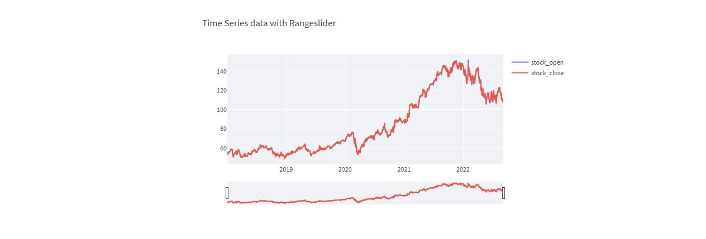
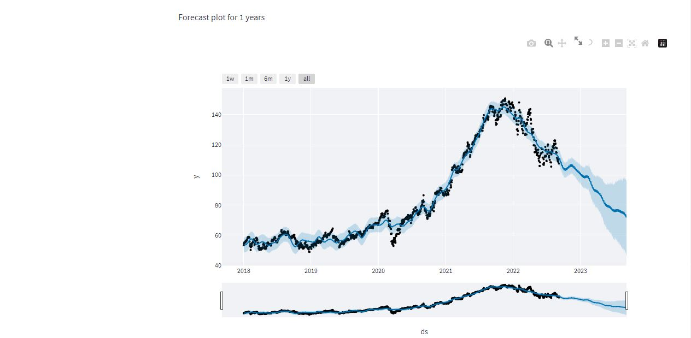
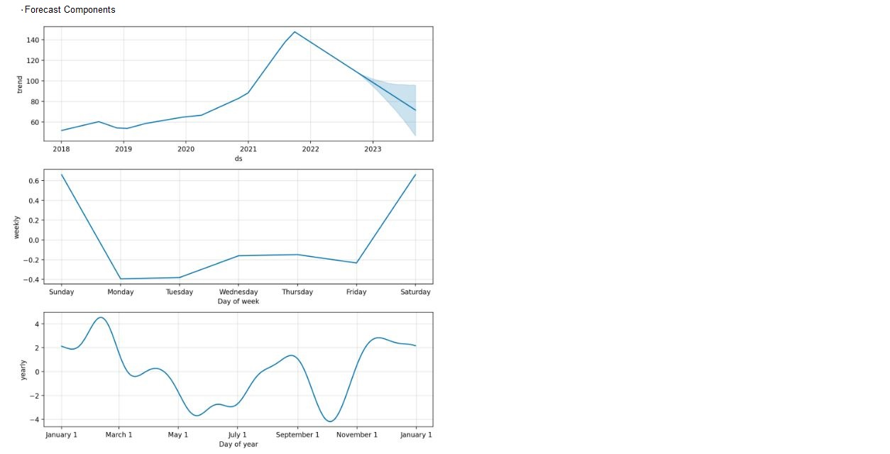

## Stock Trend Prediction

## 1.Source
- The yfinance is one of the famous modules in Python, which is used to collect online data, and with it, we can collect the financial data of Yahoo. With the help of the yfinance module, we retrieve and collect the company's financial information (such as financial ratios, etc.) as well as the histories of marketing data by using its functions.
- In this project we are using top 4 gaint stocks [GOOG, AAPL, MSFT, META] online data for stock trend predictions.
- Technology and tools wise this project covers,
-    1.Python
-    2.Prophet for implementing Time-Series forecasting procedure in R and Python
-    3.Plotly for interactive data visualization
-    4.yfinance for getting online stock datasets
-    5.visual studio code and pycharm as IDE
-    6.Python Streamlit an open source app framework for our UI and https requests
-    7.Git and Github for our source code version control

## 2.Features
- Simple responsive UI
- Select dataset for prediction [GOOG, AAPL, MSFT, META]
- Years of prediction [ 1 ====> 4]
- Time Series with Range slider[Stock_Open, Stock_Close]
- Forecast data
- Forecast Plots based on selection number of years [ 1 ====> 4 ]
- Forecast Components Plots [Yearly, Weekly, Trend]

## 3.Usage
- Clone my repository here ===> ( https://github.com/balusena/balugithub/tree/master/Stock_Trend_Forecasting )
- Open CMD in working directory.
- Run following command.
- pip install -r requirements.txt
- 'app.py' is the main Python file of Streamlit Web-Application. 
- To run app, write following command in CMD. or use any IDE.
- streamlit run app.py
- run the app app.py by logging into your streamlit account it works as intended when you follow the instruction stated in this document. 

## 4.Screenshots Stock_Trend_Prediction
### 1.Stock_Price_Predition_stoc_data_selection 

### 2.Stock_Price_Predition_Years_of_selection_2

### 3.Stock_Price_Predition_loading_raw_data_3

### 4.Stock_Price_Predition_Time_Series_data_with_Range-slider_4

### 5.Stock_Price_Predition_Forecast_data_5

### 6.Stock_Price_Predition_Forecasting_for_Years_6

### 7.Stock_Price_Predition_Forecast_Components_7

## 5.Heroku deployment
- The app is deployed on Heroku at https://stock-price-prediction-appli.herokuapp.com

## Follow thse steps to deploy your streamlit app successfully into Heroku Cloud Platform
- Deploy using Heroku Git
- Use git in the command line or a GUI tool to deploy this app.

- Install the Heroku CLI
- Download and install the Heroku CLI.

- If you haven't already, log in to your Heroku account and follow the prompts to create a new SSH public key.

- $ heroku login
- Clone the repository
- Use Git to clone stock-price-prediction-appli's source code to your local machine.

- $ heroku git:clone -a stock-price-prediction-appli 
- $ cd stock-price-prediction-appli

- Deploy your changes
- Make some changes to the code you just cloned and deploy them to Heroku using Git.

- $ git add .
- $ git commit -am "stock-price-prediction-appli_commit"
- $ git push heroku master

## 6.Further work to be done
- 1.The current implementation would work well for Stocks not in the dataset selection. It will also work for stocks that are listed in yahoo finance online site.
- 2.Need to implement the stock predictions on different stocks by using other finance python packages Alpha vintage, Pandas DataReaders, Twelve Data and compare results
- 3.Aiming to work with larger and real-world-stock-dataset and build an end to end stock_price_trend_prediction application.
- 4.Find a way to pedict the trend of different stocks with time series implementation (I would be grateful if someone could help me on this project enhancement.)

